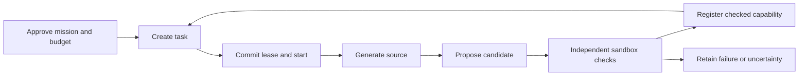

# CheckedFlow

**Generate a procedure, check it independently, and reuse it with its evidence intact.**

CheckedFlow is a Python runtime that records **who may do work, what it costs, what was checked,
and whether the result is still reusable under a declared contract**. It coordinates four
administrative organizations through signed commands and a small deterministic state machine.
CometBFT orders the commands; workers execute code separately in Linux gVisor sandboxes.
Optional **A2A and MCP adapters** let agent services and agent applications submit the same
signed commands and inspect the same committed evidence through standard protocol SDKs.

For example, one worker generates a function that doubles each integer in an array. Independent
workers check its actual Python output. After three organizations attest to matching results,
the function can become a dependency of a second generated function that also adds one. If the
first function expires or is revoked, dependent functions lose their reusable status too.

Version **0.1.0** is an experimental reference implementation. Its complete demonstration uses
31 finite inputs and actual generated Python. See the [audit against the original plan](docs/audit.md) and
[executed validation record](docs/validation-status.md) for the current scope.

The **0.2.0 development branch is not release-qualified**. Its separate v2 path handles bounded
repository-patch work. For example, a worker runs a proposed invoice calculation fix in gVisor;
the trusted observer compares declared inputs and expected outputs outside the candidate process.
Independent organizations then attest to the evidence. A committed completion is not acceptance,
and acceptance of one patch does not authorize opening a pull request or reusing it on another base.

Start with the concepts below for the published reference runtime. For development APIs, use these
guides; complete generation orchestration and operational deployment are still unfinished.

| Development question | Guide |
|---|---|
| How is a patch checked, accepted and reused? | [Patch contract](docs/repository-patch.md), [organizational verification](docs/work-acceptance.md), [reuse](docs/repository-reuse.md) |
| What happens after a worker crashes? | [Durable worker SDK](docs/worker-supervision.md), [sandbox recovery](docs/sandbox-recovery.md), [freshness watchdog](docs/dispatch-watchdog.md) |
| How are retries kept finite? | [Persistent scheduling](docs/worker-scheduling.md); fixed call limits, deadlines and local stop survive process restarts |
| How do agents connect to v2? | [Operational A2A/MCP](docs/operational-agents.md); explicit protocol selection and native signed-command admission |
| How are client permissions checked? | [Client access](docs/client-access.md); operator-owned mission roles, signed actors and callback ownership |
| How are remote connections protected? | [Mutual TLS and proxies](docs/agent-tls.md); required client certificates plus independent Bearer and mission checks |
| How can agents read artifact bytes? | [Authorized downloads](docs/artifact-download.md); explicit mission publication, HTTP bytes and an MCP read tool |
| Where are callback credentials kept? | [Callback custody](docs/callback-secrets.md); encrypted private journal and separately provisioned keys |
| How are evidence and bounded records retained? | [S3 storage](docs/s3-storage.md), [retention](docs/retention-backup.md), [settled-work retirement](docs/work-archive.md) |
| How is application state restored? | [Application history recovery](docs/application-backup.md); validator ownership needs separate recovery |
| Can it open a pull request automatically? | [Effect supervision](docs/effect-supervision.md) connects approval, current checks, one draft operation and signed reporting; disabled by default, with staging and complete deployment recovery still incomplete |
| What if an external request loses its reply? | [V2 effect records](docs/work-effects.md) keep the original reservation, full modeled charge and unknown result; governed reconciliation cannot authorize a second send |
| What if local recovery records are damaged? | [Submission recovery](docs/worker-supervision.md) rejects missing identity records; preserve journals and reconcile original commands instead of starting again |
| What has actually been tested? | [Implementation ledger](docs/implementation-0.2.0.md), [four-VM observations](docs/vm-laboratory-2026-09-26.md) |

## The concepts in one minute

| Term | Meaning | Example |
|---|---|---|
| **Mission** | An approved boundary for workers, contract, budget and lifetime | Spend at most 4,096 units on integer-array procedures. |
| **Task** | One piece of generation, execution, verification or repair work | Generate a function for `double → increment`. |
| **Lease and fence** | A committed owner, deadline and increasing attempt number | Only worker A with fence 2 can finish this attempt. |
| **Candidate** | A source artifact awaiting sufficient checks | A new `solve(values)` function. |
| **Capability** | A registered artifact with provenance, checks and dependencies | The candidate becomes `checked` after the required attestations. |
| **Residual** | A retained unresolved obligation, with a reason and recheck trigger | A timed-out attempt has an unknown outcome. |



There are three different decisions: a signature establishes **authority**, CometBFT establishes
**committed order**, and verifier attestations establish **acceptance under a contract**. None
substitutes for the others. [Concepts and guarantees](docs/concepts.md) explains these distinctions.

## Try it without running a cluster

Install the SDK and CLI with Python 3.12–3.14:

```sh
python -m pip install checkedflow
checkedflow example
python -m checkedflow.data.examples.sdk
```

For source development with uv, from this directory:

```sh
uv sync --frozen --all-extras --group dev
uv run checkedflow example
uv run python -m checkedflow.data.examples.sdk
```

The first example emits JSON containing Python source and `verification: "not_executed"`.
It searches a bounded grammar; it does not execute or approve that source.
The SDK example creates ephemeral test keys, obtains three signatures for a worker registration,
and applies it to two local runtimes. It prints `registered_worker`, `height: 1`,
`replay_matches: true`, and a state hash. Keys are regenerated each run, so that hash varies.

These commands work on Windows and Linux. The [step-by-step tutorial](docs/tutorial.md) explains
the output and links to the complete, runnable SDK code. Local replay demonstrates state-machine
behavior; it does not establish distributed finality.

To install the locally built package:

```sh
uv build
python -m pip install dist/checkedflow-0.1.0-py3-none-any.whl
checkedflow --help
```

Install `checkedflow[distributed]` for the ABCI service, RPC client and worker, or
`checkedflow[agents,distributed]` for the agent gateways as well.
CometBFT and gVisor are separately provisioned external processes.

## Run generation, verification and reuse together

Prepare CometBFT **v0.40.0**, Docker configured with `runsc`, and a locally available Python image
on Linux, following [operation and recovery](docs/operations.md). Use the inspected image digest:

The draft runner also requires the [independent sandbox recovery service](docs/sandbox-recovery.md).
Start that service in a separate terminal, then use the same private journal directory below:

```sh
export CHECKEDFLOW_IMAGE='python@sha256:REPLACE_WITH_YOUR_INSPECTED_DIGEST'
export CHECKEDFLOW_SANDBOX_RECOVERY="$HOME/.local/state/checkedflow/sandbox"
uv run checkedflow demo --directory ./lab-run \
  --image "$CHECKEDFLOW_IMAGE" --cometbft /absolute/path/to/cometbft
```

The directory must not already exist. The command creates four node stores and laboratory keys,
performs three generation rounds with reuse and three from scratch, and stops its processes.
It leaves logs, committed source and evidence, and `acceptance.json` in that directory.
The runner uses the fixed local image and refuses execution if gVisor is unavailable.

| Report field | How to read it |
|---|---|
| `common_app_hash` | All four nodes agree on state at one common committed height. |
| `unique_generated_behaviors` | Distinct output vectors among live checked generated artifacts, within this mission. |
| `copies`, `external_artifacts`, `withdrawn_artifacts` | Separate counts of duplicate behaviors, declared external artifacts and withdrawn records. |
| `spent`, `reserved`, `available` | Charged maximum work units, outstanding reservations, and unallocated budget. |
| `comparison` | Grammar candidates examined with reuse versus scratch, including initial formation. |
| `causal_acceleration: null` | No general causal acceleration estimate; the record includes a reason. |

The domain is arrays of length 0–2 whose elements are integers from −2 through 2. Passing covers
those 31 inputs. Both comparison conditions use the same grammar, targets, search ceiling,
verification policy and total budget. Work units are declared ceilings, not measured CPU time.
See [accounting and lifecycle](docs/state-machine.md) for the exact definitions.

## Use or extend the runtime

### Connect agents through A2A or MCP

Use A2A when one agent service needs to communicate with another. Use MCP when an agent
application needs discoverable tools and resources. Both reach a **mission gateway**: an adapter
bound to one chain and mission, backed by the operator's own validating full node.

| Interface | Available in this release | Meaning of success |
|---|---|---|
| A2A 1.0: JSON-RPC, HTTP+JSON, gRPC | All 11 standard service operations: send, stream, get/list, authorized cancel, subscribe, push configuration and extended card | A command acknowledgment or observed work state; acceptance remains separate. |
| MCP: stdio, Streamable HTTP, legacy SSE | Tools, resources/templates, review prompt, completion, resource notifications; local bearer or OAuth resource-server authentication | The same mission scope and signed command checks. |
| Existing worker | Lease, execute, report and propose through gVisor | A work receipt; a capability still needs independent verification. |

For a source checkout, `uv sync --frozen --all-extras --group dev` includes both adapters. For a
local wheel, install `./dist/checkedflow-0.1.0-py3-none-any.whl[agents,distributed]` with pip.
After configuring a node and mission, an MCP host can launch:

```sh
checkedflow mcp --rpc http://127.0.0.1:26657 --chain my-chain --mission array-mission
```

For A2A, set the private `CHECKEDFLOW_AGENT_TOKEN` environment variable and run:

```sh
checkedflow a2a --rpc http://127.0.0.1:26657 --chain my-chain \
  --mission array-mission --journal ./private/agent.sqlite --grpc-port 8081
```

It serves its public Agent Card on loopback port 8080, authenticated JSON-RPC at `/rpc`,
HTTP+JSON at `/v1`, and optional gRPC on port 8081. For MCP HTTP, add `--transport http` to the
MCP command; the endpoint is `http://127.0.0.1:8082/mcp`. The
[agent communication guide](docs/interoperability.md) provides complete setup, request examples,
official-client examples, status meanings and recovery steps. `checkedflow schema agents` exposes
the machine-readable profile; `checkedflow schema agent-request` exposes the request contract.

The gateway holds no signing key and never executes received source. A protocol acknowledgment
does not establish verifier acceptance. Push callbacks require an operator allowlist and public
HTTPS destinations. Cancellation requires a signed administrative reconciliation. The
[conformance matrix](docs/conformance.md) distinguishes implemented server features from optional
client roles and explicitly bounded application behavior. No LLM or arbitrary prompt interpreter
is required: agents exchange the same portable signed commands.

### Extend the state machine or a domain

The pure SDK interfaces are `transition(state, command, context)` and
`replay(initial_state, events)`. Replay includes explicit `BlockHeight` events so empty blocks
can expire leases and capabilities. A transition context must already be authenticated;
`Runtime.apply` verifies signed envelopes for ordinary SDK callers.

Schemas and vectors are included in the installed package:

```sh
checkedflow schema commands
checkedflow schema envelope
checkedflow schema state
checkedflow schema generator
checkedflow schema block
checkedflow schema vectors
checkedflow schema research
```

Use this project for bounded procedure-generation experiments, shared evidence accounting and
portable runtime-adapter development. New problem domains need their own approved contract and
worker/checker adapter. The bundled worker supports the integer-array reference verifier and
refuses external side effects. Dynamic membership, private computation, a GUI, an artifact service
and a general autonomous-agent framework are outside this release.

The core does not depend on the 18 source projects. The [research map](docs/research.md) records
the 18 software projects and 19 papers, their observed source hashes, adopted principles and
claims this implementation does not establish. A local four-node test cannot establish real
organizational independence. A negative verifier vote conservatively quarantines an artifact;
one-fault consensus progress does not imply artifact availability under a malicious veto.

## Find the right documentation

| You want to… | Start here |
|---|---|
| Understand the model and try it | [Concepts](docs/concepts.md), [tutorial](docs/tutorial.md) |
| Implement an adapter or another language | [Architecture](docs/architecture.md), [protocol](docs/protocol.md), [adapters](docs/adapters.md), [porting](docs/porting.md) |
| Operate nodes and recover interrupted work | [Operations](docs/operations.md), [state machine](docs/state-machine.md) |
| Connect A2A or MCP agents | [Agent communication](docs/interoperability.md), [machine profile](src/checkedflow/data/agents.json) |
| Assess evidence, tests and plan coverage | [Audit](docs/audit.md), [verification](docs/verification.md), [validation record](docs/validation-status.md) |
| Prepare a package release | [Release guide](docs/releasing.md) |
| Review protocol coverage and security | [Conformance matrix](docs/conformance.md), [security audit](docs/security.md), [report a vulnerability](SECURITY.md) |
| Work as an agent | [skills.md](skills.md), [SKILL.md](.agents/skills/checkedflow/SKILL.md), [documentation index](docs/README.md) |

Run local static, contract, property, coverage and selected fault checks with:

```sh
uv run python scripts/check.py --actionlint /absolute/path/to/actionlint
```

Real Linux qualification and package installation checks are separate required release gates.
The Trusted Publisher is `kadubon/checkedflow`, workflow `workflow.yml`, environment `pypi`.
Publication is manual and sends the tested wheel and sdist without rebuilding. See
[releases](https://github.com/kadubon/checkedflow/releases) and
[PyPI](https://pypi.org/project/checkedflow/) for published artifacts and their provenance.

Licensed under [Apache-2.0](LICENSE). [NOTICE](NOTICE) includes upstream protocol attribution.
