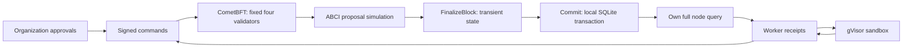

# Architecture

CheckedFlow combines a finite work graph with evidence-preserving admission. Its consistency
boundary is an authenticated pure transition over a portable JSON state.

## Modules and allowed dependencies

| Module | Responsibility | Dependencies |
|---|---|---|
| `core` | Values, state, deterministic transitions, accounting | Deterministic Python standard library only |
| `wire`, `serialization` | JSON admission, RFC 8785 bytes, typed snapshots | Core, canonicalizer |
| `identity`, `contracts` | Ed25519 authentication and offline schema validation | Core, wire, cryptography, JSON Schema |
| `runtime` | Authenticated state ownership | Core and boundary modules |
| `recovery` | Streaming block-journal validation and replay | Runtime and portable values; no network |
| `storage` | Atomic node-local state and block records | Serialization, SQLite |
| `distributed` | CometBFT ABCI and own-node RPC | Runtime, storage, optional gRPC/httpx |
| `runner` | Fixed OCI execution profile | Wire, operating system adapters |
| `synthesis` | Bounded grammar search and Python AST source emission | Core values, wire; no source execution |
| `worker` | Committed lease/start, execution, receipt, candidate proposal | RPC, runner, synthesis |
| `agents.gateway` | Mission scope, signed-command preflight, single submission and commit observation | Core and boundary modules; no protocol SDKs |
| `agents.a2a`, `agents.mcp` | Standard discovery and transport framing | Gateway and optional official SDKs; no execution or signing |

`scripts/static.py` enforces dependency direction and rejects clocks, randomness, networking,
processes and other effectful APIs in the core. Block heights enter explicitly. External outputs
enter as signed attestations. Code execution never occurs inside ABCI.

## Failure and trust model

Four organizations have equal validator power and distinct keys. CometBFT requires more than
two thirds for a commit. One stopped or Byzantine validator is within the declared consensus
fault model. Two unavailable validators prevent progress. Safety relies on CometBFT's assumptions;
availability additionally requires sufficient communication and functioning local storage.

Artifact acceptance independently requires three distinct organization verifier signatures.
Consensus agreement cannot establish that a verifier's observation is true. Correctness also
requires honest independent checkers, a suitable contract, trusted operator hosts and intact keys.
A byte digest binds evidence to bytes, not to external truth.

The v1 organization registry uses the genesis validator public keys for administrative identity.
Workers use separate keys. Production signing should keep validator keys behind an organization
signer boundary; the laboratory co-locates keys solely to test protocol behavior. Generated
programs receive no keys, host credentials or Docker socket.

SQLite is a node-local implementation detail. `FinalizeBlock` prepares an in-memory candidate;
only `Commit` atomically writes state plus ordered transaction outcomes. Restart obtains the last
committed state and CometBFT replays any necessary finalized blocks. Snapshots and state sync are
deliberately unsupported; retain the full consensus block history.

## Ownership and extension boundaries

`transition` and `advance` copy their input state. `Runtime.state` also returns a copy: an adapter
cannot alter committed state by keeping a mutable reference. A proposal simulation owns its
temporary runtime; it does not publish state until `Commit` succeeds. The storage adapter owns
the SQLite transaction, not consensus ordering.

Workers own local effects and report observations. They persist candidate source with the
generation receipt before asking to register it. Proposal recovery reads that receipt and
performs no new generation. This avoids requiring a second worker-local durable queue for the
bounded reference implementation. Source consequently occupies space in both receipt and
capability records, within the same 4 MiB admission bound.

The reference synthesizer interprets a closed grammar and emits Python AST source. It does not
execute submitted Python. An external generator runs under the sandbox adapter. A new checker
belongs in a worker adapter; it must not be imported into the core or ABCI application.

The implementation deliberately uses one finite state document, one local store per node and
immutable dependency IDs. There is no peer-discovery mesh, dynamic plugin loader or shared artifact
database. State/history exhaustion requires a separately reviewed successor deployment, not an
in-place change to consensus constants. See [finite limits](state-machine.md#bounds-and-accounting).

Agent Card and MCP resource discovery describe a configured gateway; they do not discover or
authorize validators. Each gateway binds one chain/mission and queries the own-node backend on
every operation. It keeps no second task ledger. A2A and MCP can observe and submit the same work
without changing core state formats. In-process preflight cannot decide finality; the gateway
confirms the command digest after submission or reports an unknown outcome. See
[agent communication](interoperability.md) for the trust boundary and application contract.

The A2A journal is a rebuildable observation index with durable timestamps, history and cursor
keys, plus non-rebuildable callback settings. It never authorizes execution or changes replay.
Its clocks, SQLite storage, callback DNS/TLS and protocol SDKs remain outside the deterministic
core. Protocol handlers share Gateway admission; bindings, journal, push delivery and OAuth
verification are separate modules. MCP notifications are refetch hints derived from committed
records, not an extra event authority. See [conformance](conformance.md) for the supported roles.

## External effects in the operational profile

V2 [effect records](work-effects.md) keep intent, administrative authorization, executor reservation
and provider observation separate. They enter the same atomic state and replay boundary as budgets
and candidates. A possibly sent operation consumes its full modeled ceiling and cannot be reset
for retry. The GitHub intent resolver derives exact provider arguments from a validated current
reservation; provider I/O and local freshness remain outside consensus. The maintained actuator,
compensation and effect archival are not yet complete. See [ADR 0004](adr-0004-effect-reservations.md).
