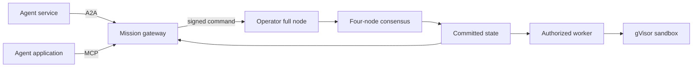

# Agent communication: A2A and MCP

Use **A2A** to coordinate work between agent services. Use **MCP** to expose that work as tools,
resources and prompts to an agent application. Both adapters call the same `Gateway`, configured
for one chain and one mission, through an operator-owned validating node. They hold no signing
keys, execute no received code and cannot change the authority rules.

The default application contract remains `checkedflow/v1`. Development deployments may select
`--protocol v2` with `--access-policy PRIVATE_POLICY` on either CLI server; read [operational agent transports](operational-agents.md)
for native v2 records, command restrictions and outstanding security qualification. The connected
server's profile/schema resources identify its selected contract. `checkedflow schema agents`
continues to export the published v1 profile.

The wire versions are [A2A 1.0](https://a2a-protocol.org/latest/specification/) and
[MCP 2026-07-28](https://modelcontextprotocol.io/specification/2026-07-28). The uv lock selects
official A2A SDK 1.1.5 and MCP SDK 2.2.0. See the [conformance matrix](conformance.md) for operations,
transport bindings, tests and application limits. The installed `checkedflow schema agents`
command exports the machine-readable profile.



## Prerequisites and installation

```sh
python -m pip install 'checkedflow[agents,distributed]'
```

Bootstrap the four organizations, workers, verifier and mission as described in
[operations](operations.md). Confirm that `checkedflow state --rpc http://127.0.0.1:26657` reads
your own node and that its chain and mission match the gateway arguments. A remote RPC service
selected by an arbitrary client is not a trusted backend. Gateways do not bootstrap a mission.

Use separate gateway processes and credentials for separate missions. V2 requires
[client policy](client-access.md); clients granted inspection can see the shared mission, including
source and evidence. V1 retains its published single-operator boundary. A client still needs the
appropriate registered signatures to mutate it. The public Agent Card contains interface
descriptions; it does not contain mission records or callback credentials.

## A2A service

Set `CHECKEDFLOW_AGENT_TOKEN` through your process supervisor or secret store. It must contain at
least 32 printable ASCII characters without whitespace. Do not put the token on a command line,
in a URL or in a tracked configuration file. Then start:

```sh
checkedflow a2a --rpc http://127.0.0.1:26657 --chain my-chain --mission array-mission \
  --journal ./private/agent.sqlite --callback-key-file ./private/callback-keys.json \
  --grpc-port 8081 --push-host callbacks.example.org
```

| Endpoint | Purpose |
|---|---|
| `GET http://127.0.0.1:8080/.well-known/agent-card.json` | Public service discovery |
| `http://127.0.0.1:8080/rpc` | Authenticated JSON-RPC and SSE responses |
| `http://127.0.0.1:8080/v1` | Authenticated HTTP+JSON binding |
| `127.0.0.1:8081` | Optional authenticated gRPC binding |

HTTP requests use `Authorization: Bearer ...` and `A2A-Version: 1.0`. gRPC uses corresponding
lowercase metadata keys. Omitting `--grpc-port` disables gRPC and omits it from the card. A
tenant, when supplied, must be the configured mission. All RPC/REST/extended-card routes require
authentication; a browser Origin is rejected by default. The CLI binds numeric loopback only.
Remote access needs an authenticated encrypted tunnel or a properly secured TLS termination.
The `create_app` SDK factory accepts the advertised external `/rpc` URL. Keep the REST `/v1`
and gRPC addresses consistent with that deployment; do not advertise an unreachable interface.

### Send a signed command or track work

Send one JSON data part. For example, this **template** acknowledges a submitted command:

```json
{
  "jsonrpc": "2.0", "id": "rpc-1", "method": "SendMessage",
  "params": {
    "message": {
      "messageId": "THE_SIGNED_COMMAND_ID", "contextId": "array-mission", "role": "ROLE_USER",
      "parts": [{"data": {"operation": "submit", "envelopeJson": "THE_COMPLETE_SIGNED_JSON_TEXT"}}]
    }
  }
}
```

The uppercase strings are placeholders. Use a legitimately pre-signed envelope; the packaged
client example accepts one without creating keys or approvals:

```sh
python -m checkedflow.data.examples.agents a2a --url http://127.0.0.1:8080 \
  --envelope ./approved-envelope.json
```

`messageId` must equal signed `command.id`. The optional context must match the mission. Keep
the envelope as a JSON **string**, not an object: SDK number conversion could erase the
difference between `1` and `1.0`, or duplicate keys, before verification. Inner JSON is parsed
strictly; Ed25519 authenticates canonical domain-separated command bytes.

| Data-part operation | Fields | Result |
|---|---|---|
| `profile` | `operation` | Direct Message with the versioned profile |
| `inspect` | `operation`, `kind`, `identity` | Direct Message with committed data |
| `submit` | `operation`, `envelopeJson` | Direct Message confirming the command digest |
| `task` | `operation`, `envelopeJson` | Tracked Task for a signed `task.*` command |

Inspection kinds are `mission`, `tasks`, `task`, `capability`, `residual`; identity is empty for
mission/tasks. The [data-part schema](../src/checkedflow/data/agent-request.schema.json) rejects
unknown fields. A valid data part does not establish enclosed signature validity.

For `task`, set `configuration.returnImmediately=true` to return the current state. Otherwise
`SendMessage` waits until terminal or interrupted (`INPUT_REQUIRED`/`AUTH_REQUIRED`). Streaming
returns the initial task, artifact updates and status updates. Direct `submit` remains a commit
acknowledgment in either sending mode. If `message.taskId` is supplied, it must equal the signed
task payload ID. Reference task IDs are context only and must be visible in the same mission.
No arbitrary text/media interpreter or external URL fetch is advertised.

### Read, list, subscribe and cancel

`GetTask` returns committed task data in `metadata.checkedflowJson`, and an artifact containing
the work receipt when available. `ListTasks` supports context/status/time filters, artifacts,
history and authenticated page tokens. Default page size is 50, maximum 100. Ordering is by
descending durable observation time, with ID as a tie-breaker. Time filters are inclusive.
If the listing changes between pages, the cursor is rejected: restart the listing instead of
silently losing or duplicating rows. Cursors are bound to filters, page size, journal and mission.

The journal records up to 64 observed status updates as history messages; the default response
omits history, zero explicitly omits it, and a positive `historyLength` returns at most that many.
It can coalesce transitions between polls. Its monotonic observation timestamps survive a clock
rollback and restart. They are **gateway observations**, not consensus timestamps or a complete
audit log. Retain CometBFT history for authenticated replay. Do not delete the journal to repair
consensus: it has no execution authority.

| Core state | A2A state | Interpretation |
|---|---|---|
| `ready` | `TASK_STATE_SUBMITTED` | Available for an authorized lease |
| `leased`, `running` | `TASK_STATE_WORKING` | Ownership/dispatch committed |
| `uncertain` | `TASK_STATE_INPUT_REQUIRED` | Outcome needs reconciliation |
| `abandoned` | `TASK_STATE_CANCELED` | Administrative reconciliation abandoned work |
| `finished`, outcome `fail` | `TASK_STATE_FAILED` | Failed work/check receipt |
| Other `finished` | `TASK_STATE_COMPLETED` | Receipt exists; acceptance remains separate |

`SubscribeToTask` sends the current task followed by updates; terminal tasks must be read with
`GetTask`. Streams close at terminal/interrupted states. Disconnecting stops observation, never
the committed work. Reconnect and read the latest task; transport streams are not replay logs.

`CancelTask` accepts an uncertain task only. Put the original signed `task.reconcile` envelope
with matching ID and `retry=false` in `metadata.envelopeJson`. It still requires three
organization signatures. Missing approval or a running/finished task cannot be canceled by a
transport token. Inspect and reconcile external effects before preparing that envelope.

### Push notifications and authenticated discovery

Create/get/list/delete notification configurations through the four standard operations, or
attach a configuration when sending `operation=task`. Configurations survive restart. Delivery
posts the current task to the callback as `{"task": ...}`. A configured token becomes
`X-A2A-Notification-Token`; an optional `authentication.scheme="Bearer"` (case insensitive) credential is sent
only to that callback. Use a dedicated callback credential.

Callbacks require `--push-host` operator approval, HTTPS port 443, public-only DNS answers, a
connection pinned to the inspected IP, and TLS verification against the original hostname.
Credentials in URLs, private/mixed DNS answers, redirects and invalid header characters are
rejected. Network access here belongs to the gateway; generated sandbox code remains offline.
There are at most 256 configurations and three failed delivery attempts before reconfiguration
is required. Updates may coalesce. Delivery can be duplicated if a crash occurs after the receiver
accepts but before local acknowledgment; receivers must deduplicate task/status data. This is
notification delivery, never execution retry.

Keep the journal and SQLite sidecars in a private directory. Protect it with OS ACLs on Windows;
POSIX mode bits alone do not establish Windows access control. It contains sealed callback configurations and cursor authentication material.
Keep the encryption keyring separately protected; callback tokens and credentials are omitted
from API responses. See [callback custody and recovery](callback-secrets.md). Run one process per journal. `GetExtendedAgentCard` requires
authentication and includes the configured mission description.

## MCP service

An MCP host can launch a child process, with protocol frames on stdout and diagnostics on stderr:

```sh
checkedflow mcp --rpc http://127.0.0.1:26657 --chain my-chain --mission array-mission
```

Host configuration typically contains `command: "checkedflow"` and the arguments above. Use an
installed executable path if the host has a different PATH. Process ownership is the stdio
admission boundary. For HTTP, set the same private token environment variable and add
`--transport http`; the endpoint is `http://127.0.0.1:8082/mcp`. `--transport sse` serves the legacy
SSE endpoint at `/sse` for older clients. Modern discovery and legacy initialization are tested.

| MCP surface | Available entry points |
|---|---|
| Tools | `checkedflow_inspect(kind, identity)`, `checkedflow_submit(envelope_json)` |
| Resources | `checkedflow://profile`, `checkedflow://mission`, `checkedflow://schemas/envelope` |
| Resource templates | `checkedflow://tasks/{identity}`, `checkedflow://capabilities/{identity}`, `checkedflow://residuals/{identity}` |
| Prompt | `checkedflow_review(identity)`: review evidence without executing it |
| Completion | Mission-visible ID prefixes for the templates and review prompt |
| Notifications | Modern `subscriptions/listen` with resource URI subscriptions |

Tools return equivalent structured and text JSON. Domain failures set `isError=true` and carry
`error`/`message`. Annotations describe effects; they do not grant authority. Resource updates
are hints: refetch after notification or reconnection. The SDK implements version negotiation,
framing, cancellation, streaming and protocol errors. Client-side roots, sampling and elicitation
are used only by servers that need them; this runtime has no such interaction to request.

### OAuth resource-server mode

For an OAuth-capable MCP host, use an external authorization server and an operator-managed
**public** JWKS file:

```sh
checkedflow mcp --rpc http://127.0.0.1:26657 --chain my-chain --mission array-mission \
  --transport http --oauth-issuer https://issuer.example.org/ \
  --oauth-audience https://gateway.example.org/mcp --oauth-jwks ./private/public-jwks.json
```

The TLS proxy must preserve the external resource identity and bearer header. CLI binding remains
loopback. The SDK exposes OAuth Protected Resource Metadata and requires scope `checkedflow`.
Tokens require `iss`, `aud`, integer `exp`, `sub` and `client_id`; signatures use an installed
public key with unique `kid` and `alg` RS256, ES256 or EdDSA. The exact issuer and audience must
match configuration. Keys are reread to permit operator-controlled rotation; token-supplied
`jku`/`x5u` URLs are never fetched. No authorization server, client registration service or token
issuer is embedded. The SDK seam also accepts a custom `AuthSettings` and `TokenVerifier`.

## Failure handling and extension

Agent transports allow mission task operations, capability proposal/revocation and residual
resolution. Worker/verifier registration, worker revocation and mission creation use the
governance interface. Nonces, fences, roles, budgets, expiry and reuse checks remain unchanged.

If a submission or commit observation fails, `OUTCOME_UNKNOWN` means it may have committed.
Read the own-node task, nonce and receipt before recovery. Never generate a new ID or retry an
effect merely because the acknowledgment was lost. An identical committed command is
acknowledged from its digest, after authentication, without rebroadcasting into CometBFT's cache.

A2A returns domain codes in `google.rpc.ErrorInfo` within `error.data`, under
`metadata.checkedflowCode`. Invalid commands use `InvalidParams`; unavailable backends and
ambiguous submission use `InternalError`; missing scoped tasks use `TaskNotFoundError`. MCP
tools preserve the same domain codes. Received source/evidence remains untrusted data even when
it contains instructions. HTTP bodies are bounded at 8 MiB, signed envelopes at 1 MiB; outer
protocol JSON permits finite decimals, while inner command JSON permits bounded integers only.

Implement another transport over `Gateway(Backend, chain, mission)` without adding signing or
execution. Keep clocks, storage and SDKs outside the core. See [adapters](adapters.md),
[porting](porting.md), [protocol tests](../tests/test_agent_protocols.py) and
[validation](validation-status.md).
