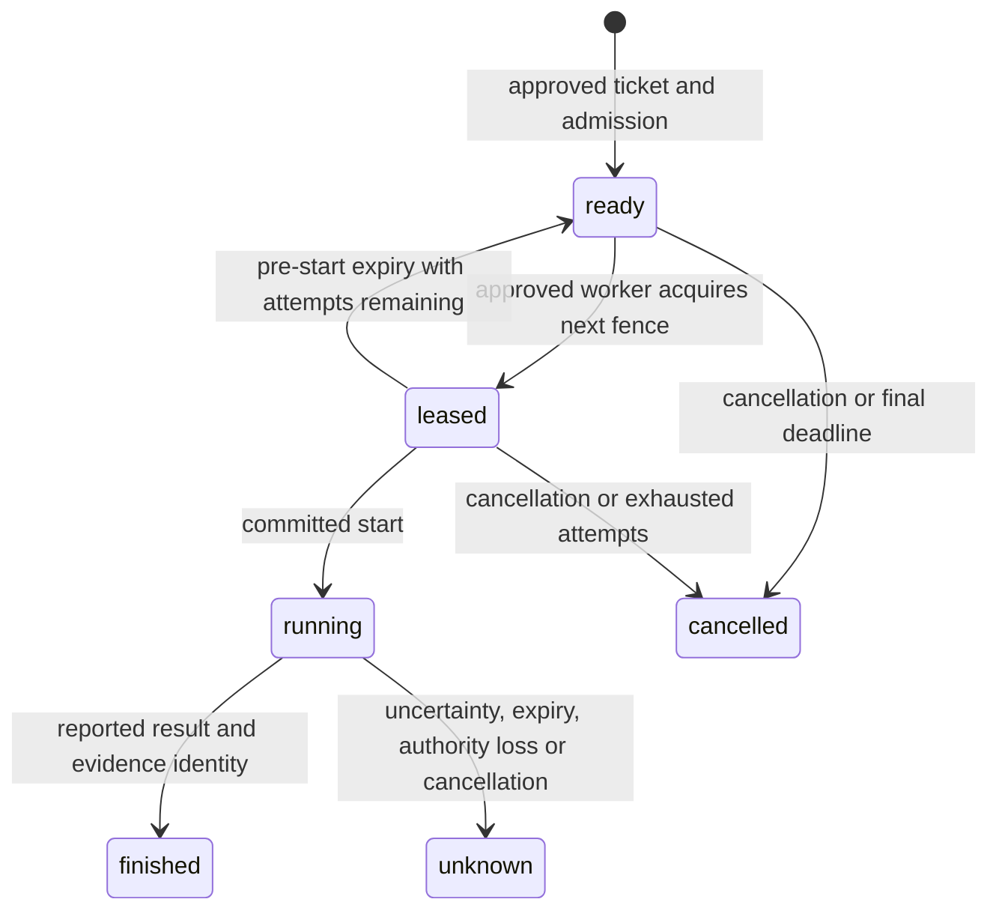

# Bounded isolated-task ownership

Status: unreleased v2 state-machine and storage component. These transitions establish who may
start an approved isolated attempt and how its modeled funding settles. They do not dispatch
code, prove node freshness, establish evidence availability or adopt an artifact. The [separate v2 ABCI adapter](operational-consensus.md) now connects these transitions to
CometBFT. Worker supervision, artifact verification quorum and conditional reuse remain incomplete.

## Admission and authority

First reserve a [budget ticket](work-budget.md) for the exact target digest and work phase.
`task.admit` attaches that still-reserved ticket to exactly one task. The signed admission fixes
the worker allowlist, lease window, final deadline and attempt limit. Its command ID becomes the
task identity. An administrative quorum must approve admission; all allowed workers must have
a currently usable key with the phase's required purpose in the same mission.

| Funding phase | Required worker key purpose |
|---|---|
| generate | producer |
| execute | executor |
| verify | verifier |
| repair | producer |

An effect-executor key cannot dispatch external effects through these isolated-task commands.
Fields outside the declared command payload are rejected. A transport token alone cannot grant
ownership. The pure transition receives an authenticated context; the SDK authenticates the
original signed bytes against its own current registry before invoking it.

## Commands and state transitions

The [task command schema](../src/checkedflow/data/task-command.schema.json) describes the exact
payloads within a signed v2 envelope. Every payload includes the configured `mission`.

| Command | Required authority | Additional payload | Result |
|---|---|---|---|
| `task.admit` | Three administrative organizations | `ticket`, `workers`, `lease_blocks`, `expires`, `max_attempts` | Create a ready task with fixed funding and scope. |
| `task.lease` | An approved worker with the required purpose | `task` | Acquire the ready task; record owner, key revision, incremented fence and lease deadline. |
| `task.start` | Exact leased owner and revision | `task`, `fence` | Record that this attempt is starting before code is dispatched. |
| `task.heartbeat` | Exact running owner and revision | `task`, `fence` | Extend the lease window, capped by the immutable task deadline. |
| `task.finish` | Exact running owner and revision | `task`, `fence`, `outcome`, `evidence` | Record reported completion or uncertainty and charge the full modeled ceiling. |
| `task.cancel` | Three administrative organizations | `task` | Release unstarted work; preserve started work as charged uncertainty. |

The evidence field is a SHA-256 digest. A digest establishes an identity, not that the referenced
bytes are available or independently correct. `outcome=reported` produces status `finished`;
`outcome=unknown` produces status `unknown`. **Finished is not checked or adopted.** The worker's
signed statement and referenced observation must still pass the separate verification contract
and organization quorum before any artifact can become reusable.

## Time, fencing and restart behavior

Consensus height is the deterministic time input. A worker must start and finish strictly before
both its lease and task deadlines. At the deadline height, the attempt has already expired.
A heartbeat cannot move the final deadline. Lease windows are 1–10,000 blocks; admission's final
deadline is within 1,000,000 blocks; attempt limits are 1–8. No wall clock enters these transitions.

Every acquisition increments the task's fence. Another worker cannot acquire a live lease, and an
old owner, old key revision or stale fence cannot start, heartbeat or finish a replacement attempt.
Replaying the exact old signed lease only acknowledges its receipt; it does not reacquire the task.
Ordinary requests consume the existing bounded journal and retain nonce continuity across rollover.

Expiration before committed start can return the task to ready while attempts remain. Expiration
after committed start produces unknown, charges the full reservation, and never queues an automatic
retry. This is deliberately conservative even when the dispatcher crashed before actually invoking
the sandbox. Absence of a finish message is not proof that execution never occurred.

Revocation or retirement of the attempt owner's specific key revision has the same conservative
effect. Before start it can release ownership for a permitted subsequent attempt; after start it
preserves unknown work. A new revision does not silently acquire the old revision's attempt.

This deterministic lease is not a freshness watchdog. During stopped consensus height, a local
dispatcher must still inhibit work when its own-node information is stale. Local time may stop
dispatch, but cannot create a consensus extension or fabricate completion. That supervisor
integration is still a release obligation.

## Mission controls and accounting

Pause prevents admission, leasing, start and heartbeat. A running owner may still submit its
result before expiry. Drain prevents new dispatch/start while allowing running heartbeats and
completion under the fixed final deadline. Resume requires the administrative control command.
This component has no external-effect reconciliation policy and must not be used to imply one.

Task-attached tickets cannot be settled through `budget.settle`, including by an administrator.
They settle through the task transitions so funding and ownership cannot diverge. Unstarted
cancellation or exhausted pre-start attempts release the reservation. Reported, unknown and
expired started work charge the full declared ceiling, not a fabricated physical-use measurement.
Unknown task records and evidence identities remain retained, even after receipt rollover.

Administrative task cancellation uses reserved control receipt capacity. Admissions and worker
commands use ordinary capacity. If ordinary receipts fill, a governed rollover can be necessary
before another result submission. Deterministic expiry still runs on committed empty blocks,
preserving uncertainty even when a worker cannot submit another receipt.

## Persistence, bounds and remaining integration

The local v2 SQLite store atomically commits task changes, funding changes, exact signed commands
and state hashes. It also commits expiration caused by empty blocks. History replay recomputes
those outcomes. Structural decoding checks task/funding consistency, historical owner purpose and
revision, and that due expiration or authority loss has already been applied. It cannot replace
authenticated bootstrap, a trusted checkpoint or independently verified consensus finality.

There are at most 128 retained tasks and 128 retained tickets. Terminal records are not pruned.
This bounds the current component and preserves unknowns, but does not satisfy the required
sustained-lifecycle archive profile. Earlier unpublished v2 development snapshots without the
required task member are rejected rather than silently reinterpreted; published v1 replay is unchanged.

Tests use real signed commands, an independent operation-sequence model, conflicting ownership,
boundary expiry, key revocation, immutable funding, snapshot corruption, SQLite replay and empty
blocks. They do not establish actual multi-host dispatch, gVisor worker supervision, evidence quorum,
artifact registration, dependency invalidation or reuse. Those remain required integrations before release.
